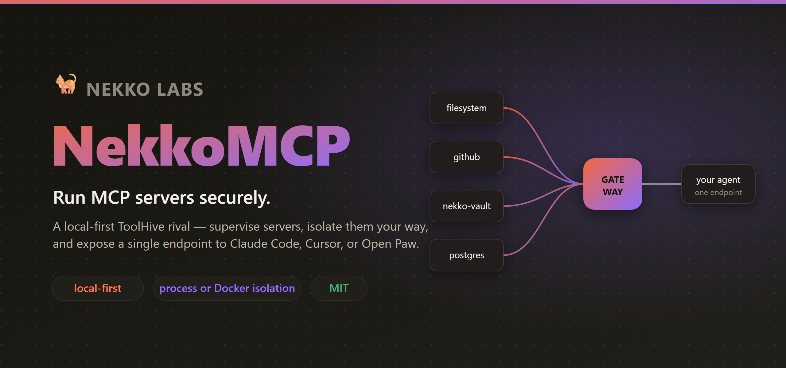

# NekkoMCP



**Local-first runtime & manager for MCP servers — a [ToolHive](https://github.com/stacklok/toolhive) rival you own.** Run MCP servers securely, supervise them, and expose **one gateway endpoint** any agent harness (Claude Code, Cursor, [Open Paw](https://github.com/nekko-labs/open-paw), Codex) can use. Not just a connector list — a proper server runtime.

> Open source · MIT · [nekko-labs](https://github.com/nekko-labs). Standalone app **and** an embeddable tab in Open Paw.

## Why
Open Paw and Claude Code are MCP *clients*. NekkoMCP is the piece they need: a secure local *server runtime/manager* — a supervisor + an aggregating gateway. Add servers from a catalog (or custom), pick how they're isolated, start them, and paste one URL/command into your agent.

## Isolation — your choice (the tradeoff, plainly)

| Runtime | Isolation | Pros | Cons |
|---|---|---|---|
| **Process sandbox** (default, no deps) | Scrubbed/allow-listed env, injected secrets only, restricted CWD/limits, no shell | Zero dependencies, instant, cross-platform | Weaker than a container (shared kernel) |
| **Docker** (opt-in) | Container-per-server (`docker run -i`, dropped caps, no-new-privileges) | Strong isolation + reproducibility | Requires Docker; heavier/slower cold start |

The whole isolation model reduces to *"what command do we spawn over stdio"* — process = the server's own command; Docker = `docker run -i … image`. Set it at setup, override per server.

## Architecture

```
packages/shared   types + daemon API contract
packages/core     RuntimeAdapter (Process | Docker) · Supervisor · aggregating Gateway · registry
apps/daemon       nekko-mcpd: one localhost port serving the web UI, the management API,
                  and the streamable-HTTP MCP gateway at /mcp (+ a `--stdio` mode)
apps/web          the management UI (served by the daemon at /)
```

- **Supervisor** launches each server through its `RuntimeAdapter`, connects an MCP client, tracks state/tools/logs (secrets never logged).
- **Gateway** merges every ready server's tools (namespaced `server__tool`) into one MCP server and routes calls. Exposed over **streamable HTTP** at `/mcp` (bearer-token auth, token auto-generated and shown in the UI) and over **stdio** (`nekko-mcpd --stdio`).

## Develop

```bash
npm install
npm run build
npm test            # spawns a real stdio MCP server → aggregates it via the gateway → calls a tool
npm run smoke:http  # boots the daemon → speaks MCP over plain HTTP → 401 without the token

npm run daemon                           # UI + API + /mcp gateway on http://localhost:7777
node apps/daemon/dist/index.js --stdio   # the aggregated gateway over stdio
```

### Run it as a desktop app (Windows)

```bash
npm run build && npm run tray            # tray icon in the taskbar; keeps the daemon up
```

`scripts/nekko-tray.cmd` launches a system-tray icon (right-click for **Open manager / Restart / Quit**, double-click opens the UI). A cross-platform Electron shell is planned; this is the lightweight interim.

The manager's **Settings** tab has the service options:

- **Run on startup** — launches the tray automatically at login (Windows: an `HKCU\…\Run` entry). No need to place a Startup-folder shortcut by hand.
- **Start minimized** — on launch, stay in the tray instead of opening the manager window.

`npm run dev` runs the daemon + web UI together and opens the site in your browser once Vite is ready (set `NEKKO_MCP_OPEN=0` to skip).

### Deploy targets via the Fly.io server

The catalog ships a **Fly.io** entry (`flyctl mcp server`, needs the [Fly CLI](https://fly.io/docs/flyctl/install/)). Add it, provide a `FLY_API_TOKEN` (or run `flyctl auth login`), and your agent can deploy and manage Fly apps through the one gateway URL.

### Use it from your agent

One endpoint for all your servers. HTTP (recommended, the daemon keeps supervising):

```bash
claude mcp add -t http nekko-mcp http://localhost:7777/mcp -H "Authorization: Bearer <token>"
```

or stdio: `{ "mcpServers": { "nekko-mcp": { "command": "nekko-mcpd", "args": ["--stdio"] } } }`

**Scoped agents.** The master token above sees every server. To hand a specific client a narrower token, add a **connected agent** in the UI (or `POST /api/clients`), pick which servers it may use, and give it that agent's token — it will only see and call the servers you allowed, and its calls show up under its name in Analytics.

**Open Paw** auto-detects a running daemon: Settings → MCP servers → **Connect gateway** (one click), plus an **Open manager** button that opens this UI in a workbench pane.

## Status
Kicked off 2026-06-28. **v0.4** adds **connected agents** (named, per-server-scoped gateway tokens), **registry search** (search the official open-source MCP registry from the Add flow), a **tool inspector** (click a tool to see its description + parameters), and **analytics persistence** (usage survives a daemon restart). On top of **v0.3**: process + Docker runtimes, supervisor, aggregating gateway over stdio **and** streamable HTTP (bearer token), daemon-served web UI, curated catalog, Open Paw one-click integration, a list-first redesign, and usage analytics. Next: resources/prompts aggregation, crash backoff, keychain secrets, registry background sync. See `SPEC.md`/`TASKS.md`.

## Analytics — visibility for free
Because every tool call fans through the one gateway, NekkoMCP records it: server, tool, caller (from the MCP handshake), success/error, latency, and bytes in/out. The web UI's **Analytics** tab turns that into headline metrics, a 24h call-volume sparkline, usage-by-server, a who's-calling breakdown, and a live recent-calls feed — served from `/api/analytics`. It's a private audit trail with nothing to wire up and no data leaving your machine.
